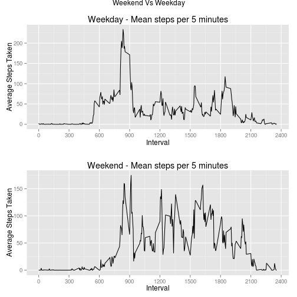

  

## Loading and preprocessing the data

```r
# Load required libraries
library(lubridate)
library(plyr)
library(dplyr)
library(stringr)
library(ggplot2)
library(grid)
library(gridExtra)
# Reproducible Research: Peer Assessment 1


## Loading and preprocessing the data
act = read.csv(file = unzip("activity.zip"),header = TRUE,stringsAsFactors=FALSE)

## Pad "interval" into mil-time format. 
act$interval=str_pad(string = act$interval,width = 4,side = "left",pad = 0)

## Create combined date-time column and parse with lubridate.
act = mutate(.data = act,datetime=ymd_hm(paste(act$date,act$interval)))
```

## Histogram of total number of steps taken each day:

```r
group_date = group_by(act,date)
sum_date = summarize(group_date,tot_steps=sum(steps,na.rm = FALSE))
ggplot(sum_date,aes(sum_date$tot_steps))+geom_histogram(colour="white")+ ylab("Frequency")+xlab("Total Steps Per Day")+
  ggtitle("Freq. of Total Steps Per Day")
```

```
## stat_bin: binwidth defaulted to range/30. Use 'binwidth = x' to adjust this.
```

 


## What is the mean and median total number of steps taken per day?

```r
mean(sum_date$tot_steps,na.rm = TRUE)
```

```
## [1] 10766.19
```

```r
median(sum_date$tot_steps,na.rm=TRUE)
```

```
## [1] 10765
```


## What is the average daily activity pattern?

```r
## Summarize for averaging, remove NAs.
group_time = group_by(act,interval)
sum_time = summarize(group_time,avg_steps=mean(steps,na.rm = TRUE))


## What is the average daily activity pattern?
## Plot time series.
ggplot(data = sum_time,aes(x=as.numeric(interval),y=avg_steps,group=1))+
  geom_line()+ylab("Average Steps Taken")+xlab("Interval")+
  scale_x_continuous(breaks=seq(from = 0,to = 2400,by = 300)) + 
  ggtitle("Mean steps per 5 minutes")
```

 

## Which 5-minute interval, on average across all the days in the act, contains the maximum number of steps?


```r
## Highest Average steps @ interval:
arrange(sum_time,desc(avg_steps))[1,]
```

```
## Source: local data frame [1 x 2]
## 
##   interval avg_steps
## 1     0835  206.1698
```


## Imputing missing values

```r
sum(is.na(act$steps))
```

```
## [1] 2304
```

```r
## Impute missing data by using the average of the time period.

# Function that substitues NA values with the mean of non-NA values
impute.mean <- function(x) replace(x, is.na(x), mean(x, na.rm = TRUE))

imputed = ddply(act, ~ interval, transform, steps = impute.mean(steps))
```

Show the histogram, mean, and median of the imputed act.


```r
imp_group_date = imputed %>% group_by(date)
imp_sum_date = summarize(imp_group_date,tot_steps=sum(steps,na.rm = FALSE))
ggplot(imp_sum_date,aes(imp_sum_date$tot_steps))+geom_histogram(colour="white")+ ylab("Frequency")+xlab("Total Steps Per Day")+
  ggtitle("Freq. of Total Imputed Steps Per Day")
```

```
## stat_bin: binwidth defaulted to range/30. Use 'binwidth = x' to adjust this.
```

 

```r
mean(x = imp_sum_date$tot_steps)
```

```
## [1] 10766.19
```

```r
median(x=imp_sum_date$tot_steps)
```

```
## [1] 10766.19
```

Imputation appears to have had a negligible impact on visualization or summary statistics.

## Are there differences in activity patterns between weekdays and weekends?


```r
# Use English locale
Sys.setlocale("LC_TIME", "English")
```

```
## Warning in Sys.setlocale("LC_TIME", "English"): OS reports request to set
## locale to "English" cannot be honored
```

```
## [1] ""
```

```r
isWeekend = weekdays(as.Date(act$date)) %in% c("Saturday", "Sunday")
act$daytype = factor(isWeekend, levels = c(FALSE, TRUE), labels = c("weekday", "weekend"))

# Weekdays

group_time = act %>% filter(daytype=='weekday') %>% group_by(interval)
sum_time = summarize(group_time,avg_steps=mean(steps,na.rm = TRUE))


p1 = ggplot(data = sum_time,aes(x=as.numeric(interval),y=avg_steps,group=1))+
  geom_line()+ylab("Average Steps Taken")+xlab("Interval")+
  scale_x_continuous(breaks=seq(from = 0,to = 2400,by = 300)) + 
  ggtitle("Weekday - Mean steps per 5 minutes")
  

# Weekends 

group_time = act %>% filter(daytype=='weekend') %>% group_by(interval)
sum_time = summarize(group_time,avg_steps=mean(steps,na.rm = TRUE))


p2 = ggplot(data = sum_time,aes(x=as.numeric(interval),y=avg_steps,group=1))+
  geom_line()+ylab("Average Steps Taken")+xlab("Interval")+
  scale_x_continuous(breaks=seq(from = 0,to = 2400,by = 300)) + 
  ggtitle("Weekend - Mean steps per 5 minutes")
  

grid.arrange(p1, p2, ncol = 2, main = "Weekend Vs Weekday")
```

 

